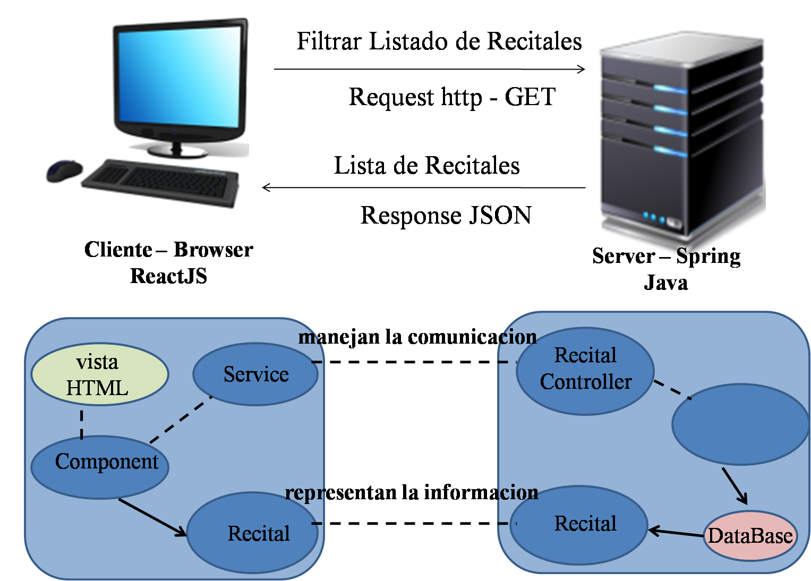

# Prueba de concepto

Nuestra solucion esta separada en 2 proyectos.
+ Modelp del Dominio - (Backend)  [ReadMe](https://github.com/fuser1988/circuitoDelUnder-Backend/blob/master/README.md)
+ Modelo de la Vista - (Frontend) [ReadMe](https://github.com/fuser1988/circuitoDelUnder-Frontend/blob/master/README.md)

## Tarea

como usuario buscar un recital por genero para asistir

## Pasos a seguir

### primer paso 

El usuario ingresa un input con el genero que quiere buscar

### segundo paso

El pedido de busqueda llega al mensaje filterGenero del objeto RecitalController, que es el encargado de resolver el pedido y enviar una respuesta. Si el pedido no tiene resultados devuelve una una lista vacia, y si lo tiene devuelve la cantidad de resultados obtenidos.

````java
	@GetMapping("/recitales/bandas")
	public List<Recital> filterGenero(@RequestParam(value = "genero") String genero) {
		return service.filterGenero(genero);
	}
````

### tercer paso

Despues se devuelve lo pedido para que el componente lea la respuesta

imagen

aca es donde se lee el resultado y lo muestra 

imagen

## Extras

 Crear modelo Recital. integrar database Postgresql al proyecto. Integrar tanto el backend como el frontend a heroku.

## Diagrama de Actividades

imagen

## Diagrama de Arquitentura



<p align="center">
  
</p>

<p align="center">
  
</p>


